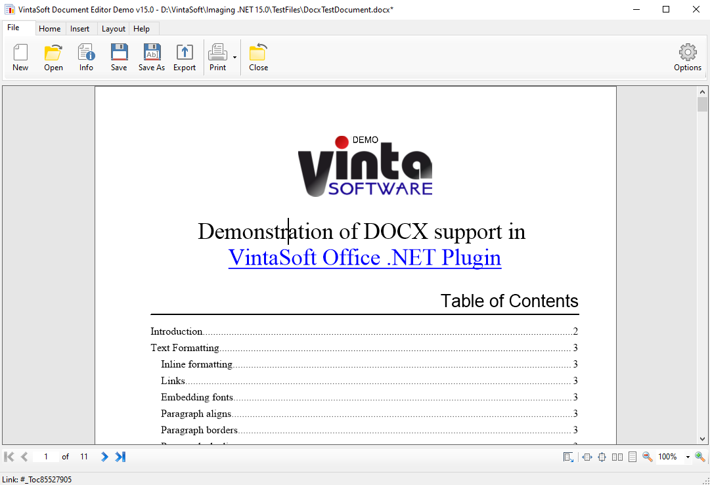

# VintaSoft WinForms Document Editor Demo

This C# project uses <a href="https://www.vintasoft.com/vsimaging-dotnet-index.html">VintaSoft Imaging .NET SDK</a> and demonstrates how to edit new or existing DOCX document in WinForms application:
* Create a new or open an existing DOCX document in WinForms document editor
* Display and print document
* Add/change/delete text content in document
* Change text properties (font, font size, bold, italic, text color, ...) in a document
* Change paragraph properties (style, text alignment, text indent, list style, ...) in a document
* Insert/delete page break
* Add/edit/delete header or footer
* Change page settings
* Change settings of page columns
* Save changes in DOCX document
* Export DOCX document to a PDF format


## Screenshot



## Usage
1. Get the 30 day free evaluation license for <a href="https://www.vintasoft.com/vsimaging-dotnet-index.html" target="_blank">VintaSoft Imaging .NET SDK</a> as described here: <a href="https://www.vintasoft.com/docs/vsimaging-dotnet/Licensing-Evaluation.html" target="_blank">https://www.vintasoft.com/docs/vsimaging-dotnet/Licensing-Evaluation.html</a>

2. Update the evaluation license in "CSharp\MainForm.cs" file:
   ```
   Vintasoft.Imaging.ImagingGlobalSettings.Register("REG_USER", "REG_EMAIL", "EXPIRATION_DATE", "REG_CODE");
   ```

3. Build the project ("DocumentEditorDemo.Net10.csproj" file) in Visual Studio or using .NET CLI:
   ```
   dotnet build DocumentEditorDemo.Net10.csproj
   ```

4. Run compiled application and try to view and annotate images and documents.


## Documentation
VintaSoft Imaging .NET SDK on-line User Guide and API Reference for .NET developer is available here: https://www.vintasoft.com/docs/vsimaging-dotnet/


## Support
Please visit our <a href="https://myaccount.vintasoft.com/">online support center</a> if you have any question or problem.
